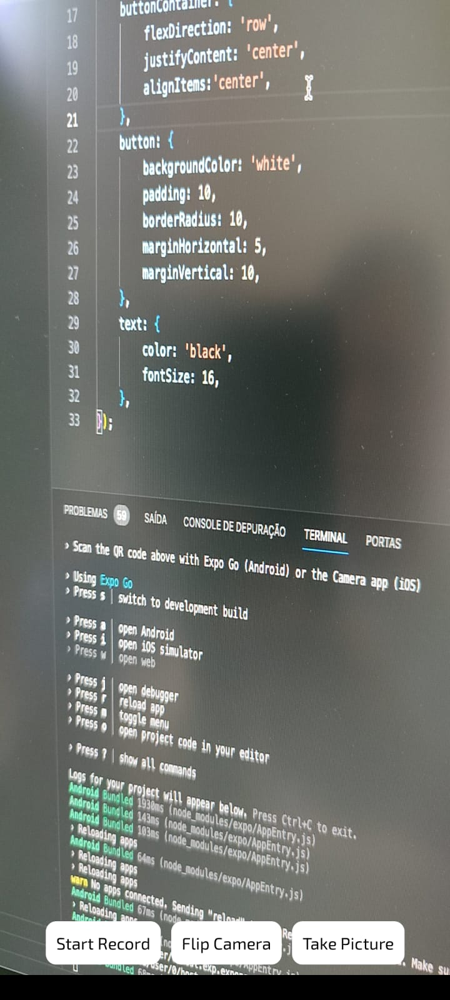
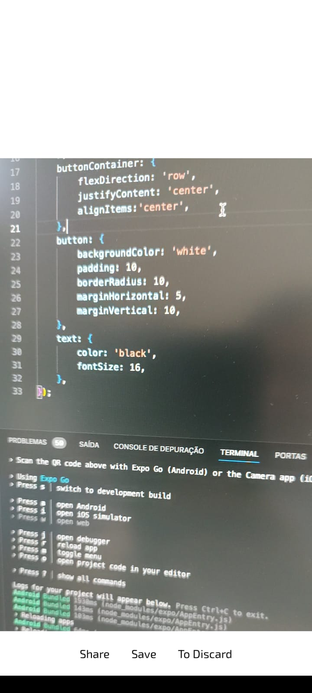

# App Camera

Este é um aplicativo de câmera simples criado com React Native e Expo. O aplicativo tem três funções principais, cada uma acessível através de um botão na interface do usuário:

## Screenshots 
<p float="left">
  
   
</p>

## Funcionalidades

1. **Start Record**: Este botão inicia a gravação de um vídeo curto. Quando a gravação é iniciada, o texto do botão muda para "Stop Recording", e você pode pressioná-lo novamente para parar a gravação.

2. **Flip Camera**: Este botão alterna entre a câmera frontal e traseira do dispositivo.

3. **Take Picture**: Este botão tira uma foto com a câmera atualmente ativa.

Após a gravação de um vídeo, o aplicativo oferece três opções:

1. **Share**: Esta opção permite compartilhar o vídeo através de qualquer aplicativo de compartilhamento instalado no dispositivo.

2. **Save**: Esta opção salva o vídeo na biblioteca de mídia do dispositivo.

3. **To Discard**: Esta opção descarta o vídeo, não salvando nem compartilhando.

## Instalação

Para instalar e executar o aplicativo, primeiro clone o repositório e instale as dependências:

```bash
git clone https://github.com/seu-usuario/app-camera.git
cd app-camera
npm install
```

Em seguida, você pode iniciar o aplicativo com o comando npm start.
```
npm start
```

## Dependências
Este aplicativo usa as seguintes bibliotecas:

- React Native
- Expo
- expo-camera
- expo-media-library
- expo-av
- expo-sharing
- typescript


## Contribuição
Contribuições são sempre bem-vindas. Sinta-se à vontade para abrir uma issue ou enviar um pull request.